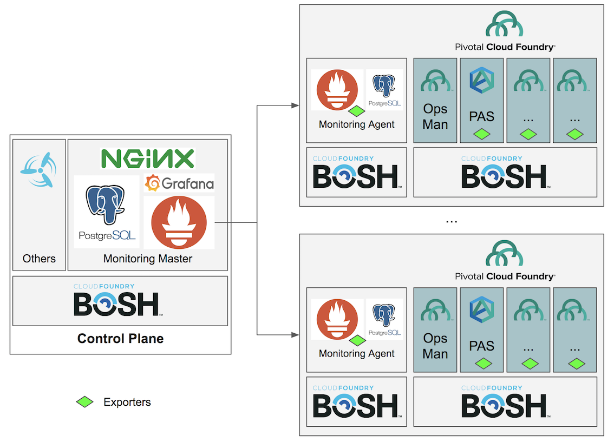
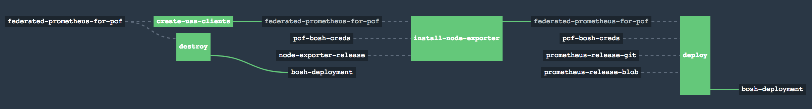

# Overview

There are two major deployment architecture patterns for Prometheus monitoring for PCF:
- All-in-one Prometheus Deployment
- Federated Prometheus Deployment

For "All-in-one Prometheus Deployment" pattern, please refer to [pcf-prometheus-pipeline](https://github.com/pivotal-cf/pcf-prometheus-pipeline).

# Federated Prometheus for PCF Monitoring

## Architecture Diagram

## Promethues Agent

There will be only one VM, based on current pipeline.
Please refer to [here](pipeline-agent/README.md) for details.

## Prometheus Master

Please refer to [here](pipeline-master/README.md) for details.

## Dashboards & Sample Screenshots

There are already a good list of dashboards out of the box, as follows.
I also attached some screenshots for reference purposes.

**1. BOSH Dashboards**

- BOSH: Deployments
- [BOSH: Jobs](screenshots/dashboard-bosh-jobs.png)
- [BOSH: Overview](screenshots/dashboard-bosh-overview.png)
- BOSH: Processes
- BOSH: System Disk Performance
- BOSH: System Disk Space
- [BOSH: System Overview](screenshots/dashboard-bosh-system-overview.png)

**2. Cloud Foundry Dashboards**

- Apps: Latency
- Apps: Requests
- Apps: System
- CF: BBS
- [CF: Cell Summary](screenshots/dashboard-cf-cell-summary.png)
- CF: Cells Capacity
- CF: Cloud Controller
- CF: Component Metrics
- CF: Diego Auctions
- CF: Diego Health
- CF: Doppler Server
- CF: Doppler Server v2
- CF: Etcd
- CF: Etcd Operations
- CF: Garden Linux
- CF: KPIs
- CF: LRPs & Tasks
- CF: Metron Agent
- CF: Metron Agent - Doppler
- CF: Metron Agent v2
- CF: Organization Memory Quotas
- CF: Organization Summary
- CF: Route Emitter
- CF: Router
- CF: Services
- CF: Space Summary
- [CF: Summary](screenshots/dashboard-cf-summary.png)
- CF: UAA

**3. Node Dashboards**

- System: Disk Performance
- System: Disk Space
- [System: Overview](screenshots/dashboard-node-system-overview.png)
       